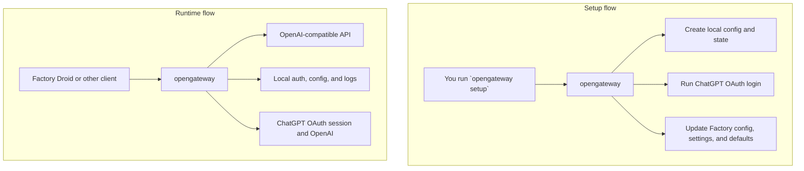

# opengateway

`opengateway` is a local OpenAI-compatible gateway for ChatGPT OAuth workflows. It keeps auth local and exposes endpoints that tools like Factory Droid can call.



Current API surface:
- `GET /healthz`
- `GET /v1/models`
- `POST /v1/chat/completions`
- `POST /v1/responses`

## Install

```bash
git clone https://github.com/Sikbik/opengateway && cd opengateway
./bin/install
```

That installs `opengateway` to `~/.local/bin/opengateway` by default.

## Quick start

```bash
opengateway setup
```

`setup` will:
- create the local gateway config if needed
- start the gateway
- run OAuth login
- merge custom models into Factory config and settings
- align Factory session and mission defaults to the preferred custom model

Useful variants:

```bash
opengateway setup --headless
opengateway login --open-browser
opengateway sync-factory
```

## Common commands

```bash
opengateway start
opengateway stop
opengateway status
opengateway logs -f
opengateway doctor
opengateway self-test
opengateway login
opengateway login headless
opengateway show-key
opengateway sync-factory
```

## Factory Droid

1. Restart `droid` if it is already running.
2. Open the Factory model picker.
3. Select one of the custom `GPT-*` entries added by `opengateway setup`.

Repo droids and machine droids are separate:
- repo droids: `<workspace>/.factory/droids`
- machine droids: resolved Factory home `droids/` directory

If droid routing drifts, run:

```bash
opengateway sync-factory
```

## Optional GUI

The GUI is an optional control surface for:
- gateway start/stop and health
- auth state and log tail
- Factory config/settings inspection
- repo and machine droid inventory
- droid model reassignment to installed custom models

Run it from the repo root:

```bash
opengateway control
```

Launcher behavior:
- WSL: starts browser mode automatically
- Linux/macOS: starts the native Tauri shell automatically

Explicit modes:

```bash
opengateway control web
opengateway control desktop
```

In WSL, only `web` is supported. Native `desktop` mode requires a real desktop Linux/macOS host.

## Experimental ACP

The `acp` branch also has an experimental ACP lane for editor/harness integrations.

Current scope:
- real adapter: `codex`
- placeholder only: `claude`
- transport: stdio

Useful commands:

```bash
opengateway acp doctor
opengateway acp serve --agent codex
opengateway acp sessions
opengateway acp inspect <session-id>
```

Important ACP rule:
- keep the editor, `opengateway`, and the Codex runtime in the same environment

This ACP lane is experimental and separate from the current HTTP / Factory gateway lane.

## Desktop builds

Prebuilt desktop packages are published through GitHub Releases:
- Windows: NSIS installer
- Linux: Debian package (`.deb`) for Ubuntu and other Debian-based distros
- macOS: DMG

The packaged Windows build bundles a native `opengateway.exe` backend and uses the WebView2 bootstrapper installer. If a default WSL environment already has both `~/.local/bin/opengateway` and `~/.factory`, the GUI prefers that WSL backend automatically; otherwise it falls back to the bundled Windows backend. That keeps the installer much smaller, but Windows may need internet access if WebView2 is not already present.

## Paths

Gateway defaults on Linux/macOS:
- config: `~/.config/opengateway/config.yaml`
- data: `~/.local/share/opengateway`
- state and logs: `~/.local/state/opengateway`
- auth files: `~/.config/opengateway/auth`

Gateway defaults on Windows:
- config: `%APPDATA%\\opengateway\\config.yaml`
- data: `%APPDATA%\\opengateway`
- state and logs: `%LOCALAPPDATA%\\opengateway`
- auth files: `%APPDATA%\\opengateway\\auth`

Factory defaults:
- home: `~/.factory`
- legacy config: `~/.factory/config.json`
- settings: `~/.factory/settings.json`
- machine droids: `~/.factory/droids`

Factory path overrides:
- `OPENGATEWAY_FACTORY_HOME`
- `FACTORY_HOME`
- `OPENGATEWAY_FACTORY_CONFIG`
- `OPENGATEWAY_FACTORY_SETTINGS`
- `OPENGATEWAY_FACTORY_DROIDS_DIR`
