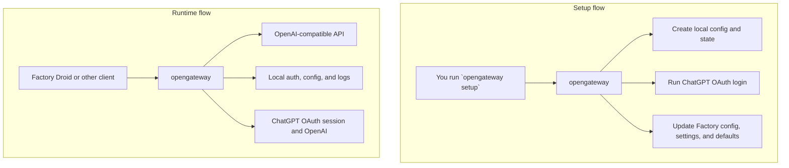

# opengateway

`opengateway` is a local OpenAI-compatible gateway for ChatGPT OAuth workflows. It keeps auth local and exposes endpoints that tools like Factory Droid can call.


```mermaid
flowchart TD
    subgraph S["Setup flow"]
        U1["You run `opengateway setup`"] --> G1["opengateway"]
        G1 --> C1["Create local config and state"]
        G1 --> O1["Run ChatGPT OAuth login"]
        G1 --> F1["Update Factory config, settings, and defaults"]
    end

    subgraph R["Runtime flow"]
        U2["Factory Droid or other client"] --> G2["opengateway"]
        G2 --> E2["OpenAI-compatible API"]
        G2 --> L2["Local auth, config, and logs"]
        G2 --> O2["ChatGPT OAuth session and OpenAI"]
    end
```

Current API surface:
- `GET /healthz`
- `GET /v1/models`
- `POST /v1/chat/completions`
- `POST /v1/responses`

## Install

```bash
git clone https://github.com/Sikbik/opengateway && cd opengateway
./bin/install
```

That installs `opengateway` to `~/.local/bin/opengateway` by default.

## Quick start

```bash
opengateway setup
```

`setup` will:
- create the local gateway config if needed
- start the gateway
- run OAuth login
- merge custom models into Factory config and settings
- align Factory session and mission defaults to the preferred custom model

Useful variants:

```bash
opengateway setup --headless
opengateway login --open-browser
opengateway sync-factory
```

## Common commands

```bash
opengateway start
opengateway stop
opengateway status
opengateway logs -f
opengateway doctor
opengateway self-test
opengateway probe-generation
opengateway probe-droid
opengateway login
opengateway login headless
opengateway show-key
opengateway sync-factory
```

## Factory Droid

`opengateway setup` and `opengateway sync-factory` configure Factory Desktop for the local gateway. The preferred default is `GPT-5.5` with `Extra High` reasoning.

1. Run `opengateway setup`, or `opengateway sync-factory` if auth is already set up.
2. Restart Factory Desktop or start a new Factory session.
3. In the Factory model picker, select the custom `GPT-5.5` entry if the active session did not pick it automatically.

Factory stores model selection on existing sessions. If an older session keeps answering as a previous model, start a new session after running `opengateway sync-factory`.

Use the probes to verify the bridge from the command line:

```bash
opengateway probe-generation
opengateway probe-droid
```

`probe-generation` verifies the OpenAI-compatible gateway path. `probe-droid` verifies Factory's bundled Droid CLI can call the gateway and write a Factory session for the current workspace.

OpenGateway exposes `GPT-5.5 Fast` as a selectable custom model. It routes to the ChatGPT/Codex account backend as `gpt-5.5` with `service_tier: "priority"` because the backend does not accept literal `gpt-5.5-fast` model requests.

Factory's `/fast` slash command only toggles Factory built-in model IDs, not BYOK custom models. To use fast mode through OpenGateway, select `GPT-5.5 Fast` in Factory's model picker or pass that custom model to the Droid CLI.

Repo droids and machine droids are separate:
- repo droids: `<workspace>/.factory/droids`
- machine droids: resolved Factory home `droids/` directory

If droid routing drifts, run:

```bash
opengateway sync-factory
```

## Optional GUI

The GUI is an optional control surface for:
- gateway start/stop and health
- auth state and log tail
- Factory config/settings inspection
- repo and machine droid inventory
- droid model reassignment to installed custom models

Run it from the repo root:

```bash
opengateway control
```

Launcher behavior:
- WSL: starts browser mode automatically
- Linux/macOS: starts the native Tauri shell automatically

Explicit modes:

```bash
opengateway control web
opengateway control desktop
opengateway control check
opengateway control build
```

In WSL, only `web` is supported. Native `desktop`, `check`, and `build` modes require a real desktop Linux/macOS host or CI.

Direct repo launcher still works:

```bash
./bin/factory-control
```

Windows repo launcher:

```powershell
.\bin\factory-control.ps1
```

If you run `opengateway control` outside the repo, pass the checkout explicitly:

```bash
opengateway control --workspace /path/to/opengateway
```

## Desktop builds

If you just want desktop artifacts, use GitHub Actions instead of setting up a local packaging toolchain.

Workflow:
- open `Desktop Artifacts` in GitHub Actions
- run it manually, or let it run from a PR / push to `main`
- download the artifact you want:
  - Windows: NSIS installer
  - Linux: Debian package (`.deb`) for Ubuntu and other Debian-based distros
  - macOS: DMG

To publish those builds to GitHub Releases:
- push a version tag like `v0.1.0`
- the same `Desktop Artifacts` workflow will build all three targets
- after the build job finishes, the workflow will create or update the GitHub Release for that tag and attach:
  - Windows installer
  - Linux `.deb`
  - macOS `.dmg`

Workflow file:
- `.github/workflows/desktop-artifacts.yml`

The packaged Windows build bundles a native `opengateway.exe` backend and uses the WebView2 bootstrapper installer. Windows runs the bundled backend by default so Factory Desktop setup reads and writes Windows Factory state. WSL is only used when explicitly requested with `OPENGATEWAY_WSL_BRIDGE`, `OPENGATEWAY_WSL_DISTRO`, `OPENGATEWAY_WSL_WORKSPACE`, or a Linux-looking `OPENGATEWAY_WORKSPACE`.

## Paths

Gateway defaults on Linux/macOS:
- config: `~/.config/opengateway/config.yaml`
- data: `~/.local/share/opengateway`
- state and logs: `~/.local/state/opengateway`
- auth files: `~/.config/opengateway/auth`

Gateway defaults on Windows:
- config: `%APPDATA%\\opengateway\\config.yaml`
- data: `%APPDATA%\\opengateway`
- state and logs: `%LOCALAPPDATA%\\opengateway`
- auth files: `%APPDATA%\\opengateway\\auth`

Factory defaults:
- home: `~/.factory`
- legacy config: `~/.factory/config.json`
- settings: `~/.factory/settings.json`
- machine droids: `~/.factory/droids`

Factory path overrides:
- `OPENGATEWAY_FACTORY_HOME`
- `FACTORY_HOME`
- `OPENGATEWAY_FACTORY_CONFIG`
- `OPENGATEWAY_FACTORY_SETTINGS`
- `OPENGATEWAY_FACTORY_DROIDS_DIR`
